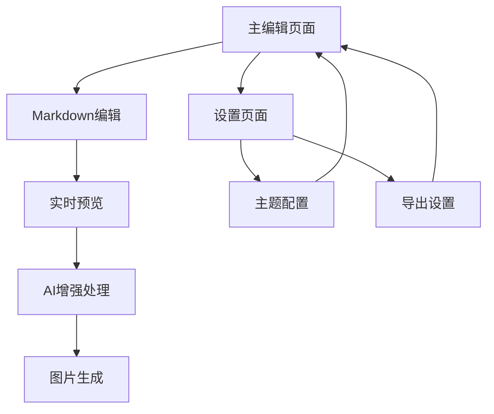

# AI Markdown 可视化图文生成器 - 产品需求文档

## 1. 产品概述

一个AI驱动的Markdown可视化图文生成器，将用户输入的Markdown文本通过AI增强和专业UI系统进行渲染，最终生成适合社交媒体传播的高清图片。

产品采用前后端分离架构，客户端优先处理实时交互，后端专注于AI处理，目标是为内容创作者提供快速、专业的图文生成工具。

## 2. 核心功能

### 2.1 用户角色

本产品无需用户注册，所有功能对访问者开放。

### 2.2 功能模块

我们的AI Markdown可视化图文生成器包含以下主要页面：

1. **主编辑页面**：Markdown编辑器、实时预览面板、工具栏控制区
2. **设置页面**：主题切换、导出配置、样式自定义

### 2.3 页面详情

| 页面名称 | 模块名称 | 功能描述 |
|----------|----------|----------|
| 主编辑页面 | Markdown编辑器 | 基于CodeMirror 6的实时编辑器，支持语法高亮、自动补全 |
| 主编辑页面 | 实时预览面板 | 实时渲染Markdown为HTML，支持分页预览和轮播展示 |
| 主编辑页面 | 工具栏控制区 | AI增强按钮、图片生成按钮、主题切换、导出设置 |
| 主编辑页面 | 分页导航组件 | 上一页/下一页箭头、页码指示器、页面总数显示 |
| 设置页面 | 主题设置 | 亮色/暗色模式切换，实时预览主题效果 |
| 设置页面 | 导出配置 | 图片清晰度选择（标清1x、高清2x、超清3x），格式选择 |
| 设置页面 | 样式自定义 | 字体大小调节、页面边距设置、风格提示词输入 |

## 3. 核心流程

**主要用户操作流程：**

1. 用户访问主编辑页面，在左侧Markdown编辑器中输入内容
2. 系统实时解析Markdown并在右侧预览面板显示渲染结果
3. 用户可使用"---"分页符创建多页内容，通过分页组件浏览不同页面
4. 用户点击AI增强按钮，系统调用后端API优化Markdown内容
5. 用户配置导出设置（主题、清晰度），点击生成图片按钮
6. 系统使用html2canvas生成当前页面的高清图片并自动下载

## 4. 用户界面设计

### 4.1 设计风格

- **主色调**：亮色模式使用米白色背景(#F7F7F7)配炭黑色文字(#2D2D2D)，暗色模式使用炭黑色背景(#2D2D2D)配柔和灰白色文字(#E8E8E6)
- **按钮样式**：硬朗直角设计，hover状态实现字母逐字向上翻滚动画效果
- **字体系统**：H1/H2使用Playfair Display展示型衬线字体，H3-H6/正文/UI使用Inter无衬线字体
- **布局风格**：单栏内容流，最大宽度max-w-3xl，大面积留白设计
- **图标风格**：简洁线性图标，与极简设计风格保持一致

### 4.2 页面设计概览

| 页面名称 | 模块名称 | UI元素 |
|----------|----------|--------|
| 主编辑页面 | Markdown编辑器 | 左侧面板，深色主题，Inter字体17px，语法高亮，最小高度600px |
| 主编辑页面 | 实时预览面板 | 右侧面板，应用主题样式，H1/H2使用Playfair Display大字号，正文17px |
| 主编辑页面 | 工具栏控制区 | 顶部固定栏，黑白反转按钮，翻滚动画效果，图标+文字组合 |
| 主编辑页面 | 分页导航组件 | 底部居中，箭头导航，圆点页码指示器，页数显示 |
| 设置页面 | 主题设置 | 卡片式布局，切换开关，实时预览缩略图 |
| 设置页面 | 导出配置 | 选项卡设计，清晰度选择器，格式下拉菜单 |

### 4.3 响应式设计

产品采用桌面优先设计，针对移动设备进行适配优化，支持触摸交互，编辑器和预览面板在小屏幕上采用上下布局。