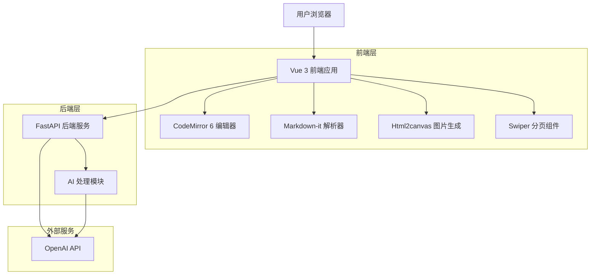
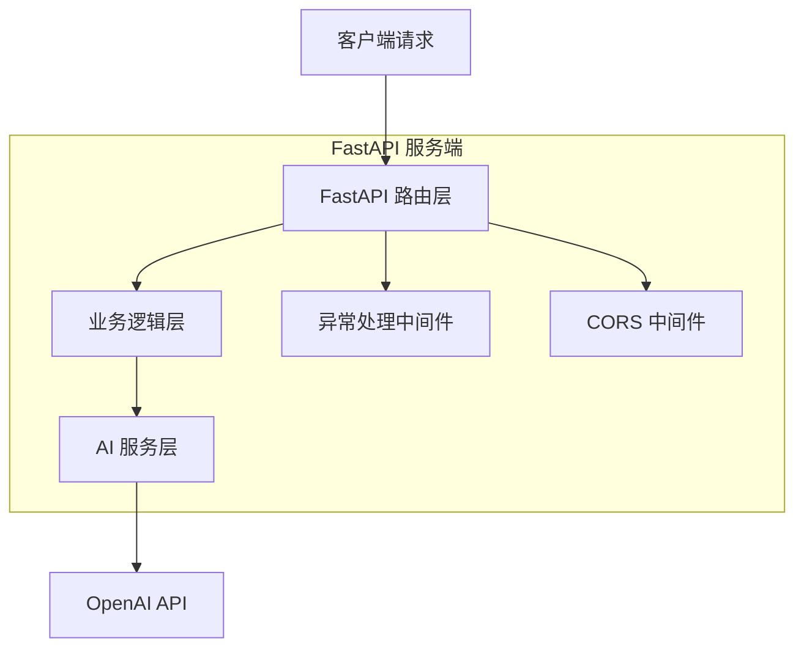

# AI Markdown 可视化图文生成器 - 技术架构文档

## 1. 架构设计



## 2. 技术描述

* **前端**: Vue 3 (Composition API) + Vite + Tailwind CSS + TypeScript

* **后端**: Python 3.10+ + FastAPI + OpenAI + httpx

* **编辑器**: CodeMirror 6

* **Markdown解析**: markdown-it

* **图片生成**: html2canvas

* **分页组件**: Swiper.js

## 3. 路由定义

| 路由        | 用途                         |
| --------- | -------------------------- |
| /         | 主编辑页面，包含Markdown编辑器和实时预览面板 |
| /settings | 设置页面，主题切换和导出配置             |

## 4. API定义

### 4.1 核心API

AI增强处理接口

```
POST /api/v1/enhance
```

请求参数:

| 参数名称           | 参数类型   | 是否必需  | 描述                                                 |
| -------------- | ------ | ----- | -------------------------------------------------- |
| markdown\_text | string | true  | 原始Markdown文本内容                                     |
| task           | string | true  | 处理任务类型：auto\_image, beautify\_table, segment\_text |
| style\_prompt  | string | false | 可选的风格提示词                                           |

响应参数:

| 参数名称                     | 参数类型   | 描述                  |
| ------------------------ | ------ | ------------------- |
| enhanced\_markdown\_text | string | AI增强后的Markdown文本    |
| status                   | string | 处理状态：success, error |
| message                  | string | 错误信息或处理说明           |

请求示例:

```json
{
  "markdown_text": "# 标题\n\n这是一段文本",
  "task": "auto_image",
  "style_prompt": "专业商务风格"
}
```

响应示例:

```json
{
  "enhanced_markdown_text": "# 🎯 专业标题\n\n这是一段经过AI优化的专业文本内容，具有更好的可读性和视觉效果。",
  "status": "success",
  "message": "内容增强完成"
}
```

## 5. 服务端架构图



## 6. 数据模型

### 6.1 数据模型定义

本项目为无状态应用，不需要持久化数据库。所有数据通过API请求传输。

**核心数据结构：**

```typescript
// Markdown页面数据
interface MarkdownPage {
  id: string;
  content: string;
  htmlContent: string;
}

// 应用配置
interface AppConfig {
  theme: 'light' | 'dark';
  exportQuality: 1 | 2 | 3;
  fontSize: number;
  pageMargin: number;
}

// AI增强请求
interface EnhanceRequest {
  markdown_text: string;
  task: 'auto_image' | 'beautify_table' | 'segment_text';
  style_prompt?: string;
}

// AI增强响应
interface EnhanceResponse {
  enhanced_markdown_text: string;
  status: 'success' | 'error';
  message: string;
}
```

### 6.2 数据流程

**实时预览流程：**

1. 用户在CodeMirror编辑器中输入Markdown文本
2. 前端监听内容变化，使用"---"分割符分页
3. 使用markdown-it将每页Markdown解析为HTML
4. 应用Tailwind CSS样式渲染到预览面板
5. 更新Swiper分页组件显示多页内容

**AI增强流程：**

1. 用户点击AI增强按钮
2. 前端收集当前Markdown内容和配置参数
3. 发送POST请求到/api/v1/enhance端点
4. 后端调用OpenAI API处理内容
5. 返回增强后的Markdown文本
6. 前端更新编辑器内容，触发实时预览

**图片生成流程：**

1. 用户配置导出参数（主题、清晰度）
2. 点击生成图片按钮
3. 前端使用html2canvas捕获当前预览页面
4. 根据清晰度设置scale参数
5. 生成Canvas并转换为图片数据
6. 触发浏览器下载图片文

