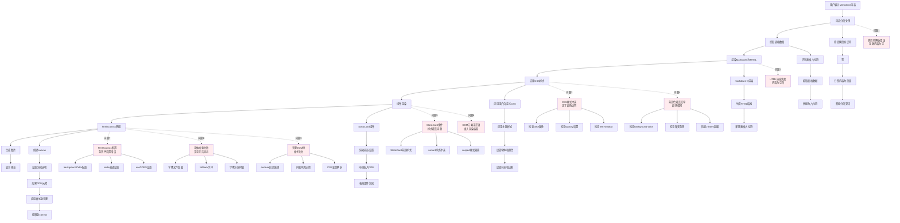

# 图片生成流程分析

## 完整流程图

## 关键问题分析

### 1. 内容处理阶段
- **换页符解析错误**: 可能导致页面内容为空
- **表格数据提取失败**: 表格无法正确显示
- **Markdown渲染异常**: HTML结构不完整

### 2. 样式应用阶段
- **CSS颜色冲突**: 文字颜色与背景色相同或透明
- **字体加载失败**: 文字无法正确渲染
- **样式优先级问题**: 重要样式被覆盖

### 3. 组件渲染阶段
- **StaticCard组件问题**: 背景样式覆盖内容
- **DOM插入失败**: 内容未正确插入渲染容器
- **Vue组件生命周期**: 渲染时机不当

### 4. 图片转换阶段
- **html2canvas配置错误**: 背景色、缩放等参数不当
- **DOM克隆问题**: 样式在克隆过程中丢失
- **异步渲染问题**: 内容未完全加载就开始转换

## 排查建议

### 立即检查项目
1. **查看浏览器控制台**: 检查是否有CSS或JavaScript错误
2. **检查渲染容器**: 确认DOM元素是否正确插入
3. **验证CSS样式**: 检查文字颜色和背景色设置
4. **测试字体加载**: 确认字体文件是否正确加载

### 逐步调试方法
1. **简化内容测试**: 使用最简单的文本内容测试
2. **禁用复杂样式**: 暂时移除自定义CSS和复杂效果
3. **检查html2canvas选项**: 调整渲染参数
4. **添加调试日志**: 在关键步骤添加console.log

### 常见解决方案
1. **强制设置文字颜色**: 在CSS中使用!important
2. **调整html2canvas配置**: 修改backgroundColor和其他选项
3. **优化字体加载**: 使用web安全字体作为fallback
4. **改进DOM克隆处理**: 在onclone回调中强制应用样式